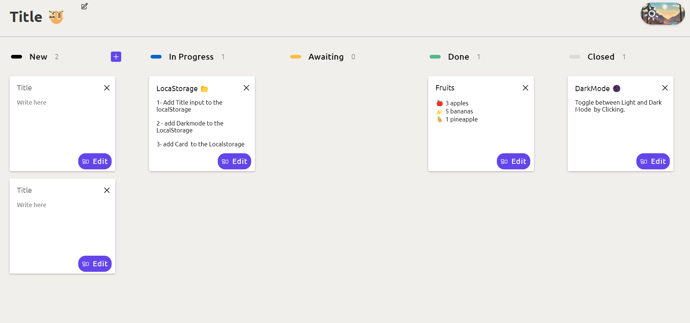
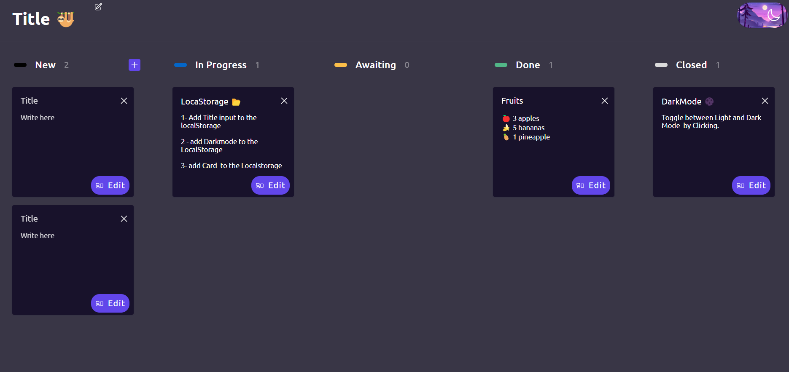

# Basic Request Page 📄

 Basic Request Page which you can Change the title by clicking the pencil icon and toggle between dark and light mode by clicking the button in the top right corner , and you can add cards by clicking the plus icon , to edit card you must click the edit button and save button to save, unfortunately I can't save the datas to localstorage .
## Screenshots

## 🔗 link
📔 https://renansouza12.github.io/Request-Page/

## Stack used

**Front-end:** 

